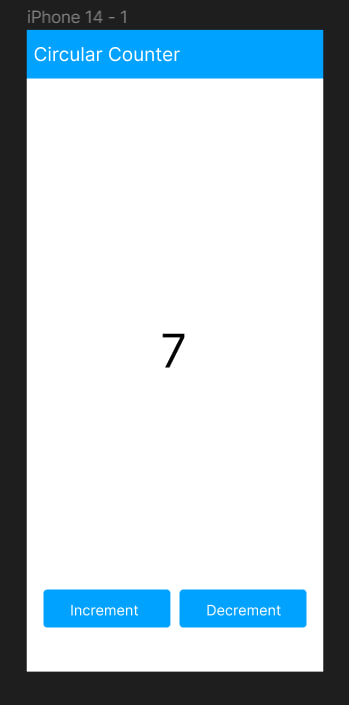
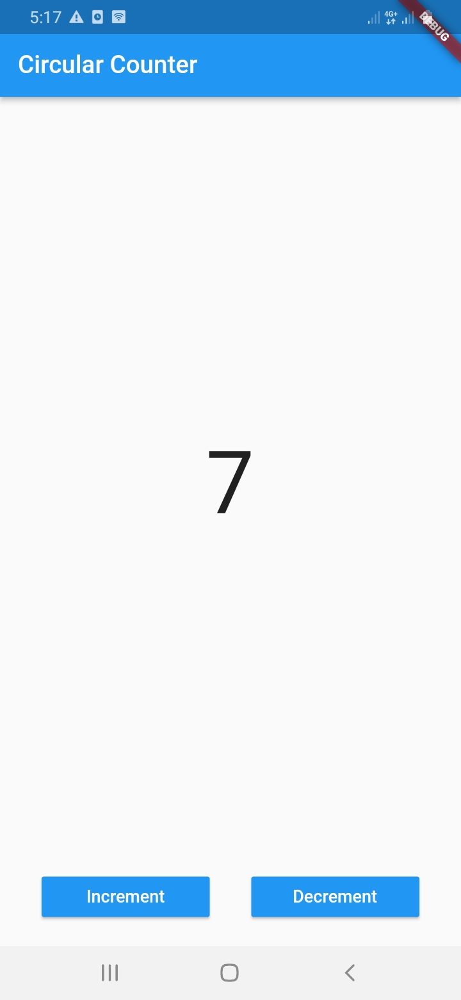

# Circular Counter App

A simple user interface with a centered text displaying the counter value and two buttons, one for incrementing the counter and the other for decrementing it.

When the counter reaches 10 and the "Increment" button is tapped, the counter resets to 0. Similarly, when the counter is at 0 and the "Decrement" button is tapped, the counter resets to 10.

## UI Design
- 

## App Screenshot
- 

