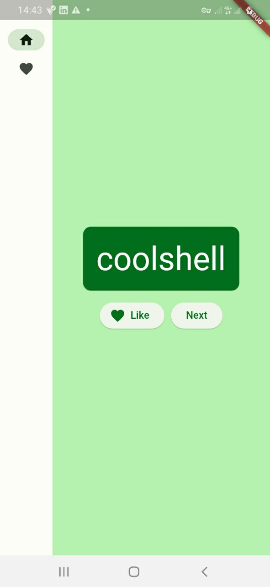
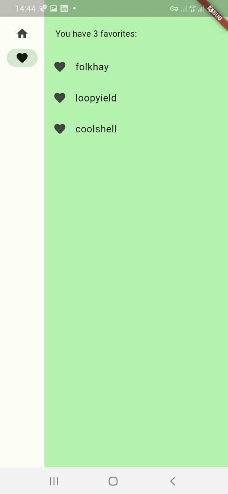

# namer_app

The application generates cool-sounding names, such as "newstay", "lightstream", "mainbrake", or "graypine". The user can ask for the next name, favorite the current one, and review the list of favorited names on a separate page. The app is responsive to different screen sizes.

# Screenshots of the UI
- 
- 