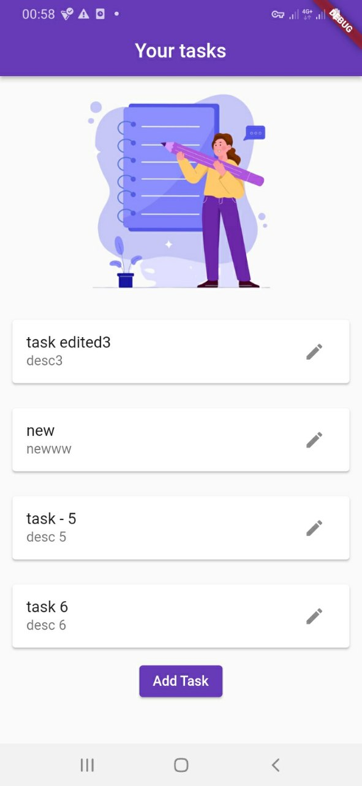

# todo_app

A todo list tracker app.

### Features:
- create task
- view task
- edit task
- remove task

### To get started:
- clone this repository
- run `flutter pub get` in the terminal
- run `flutter run`

### Screenshots of the app:
- 
- 
- 

