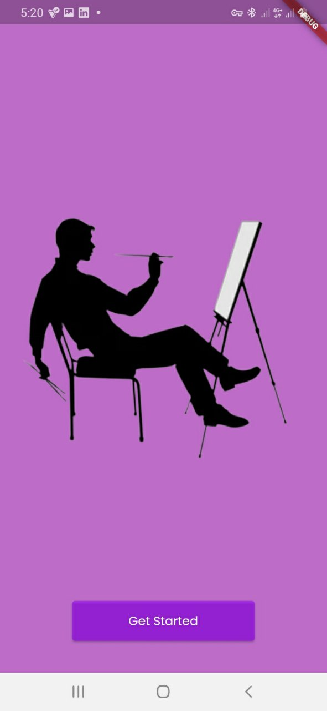
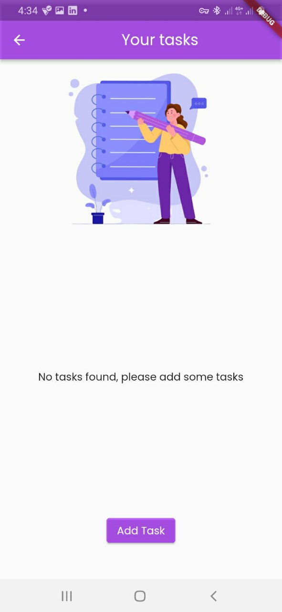
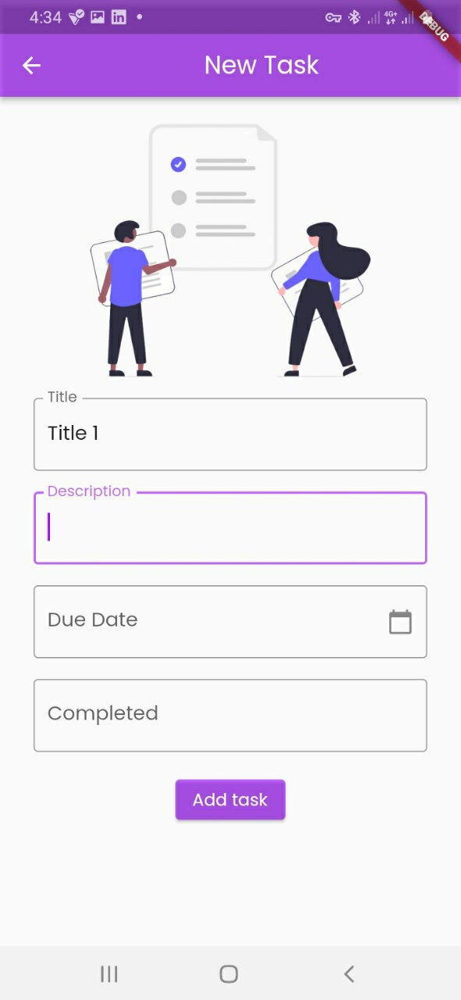
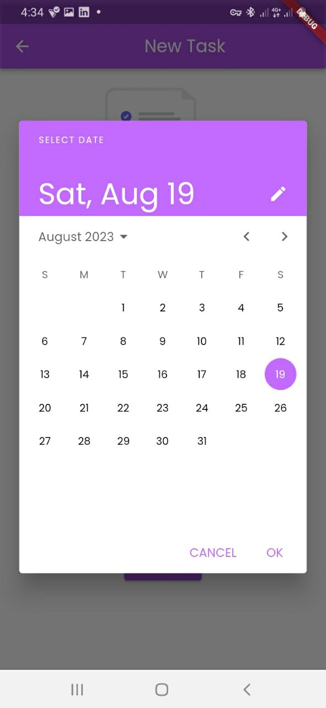
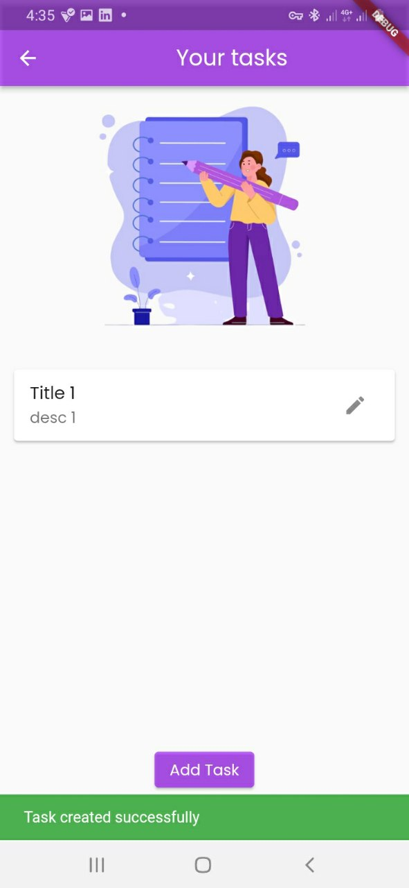
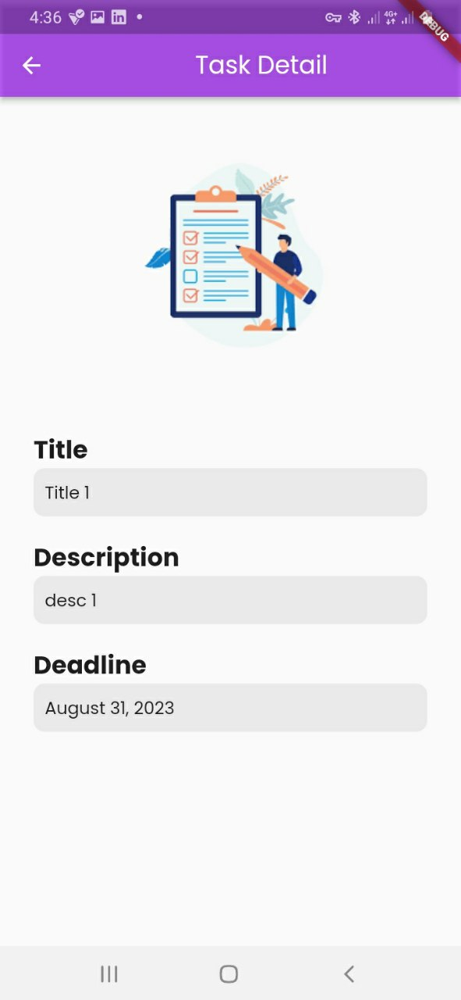
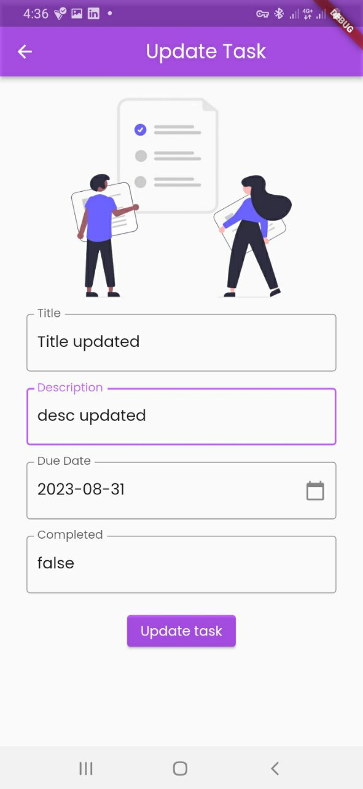
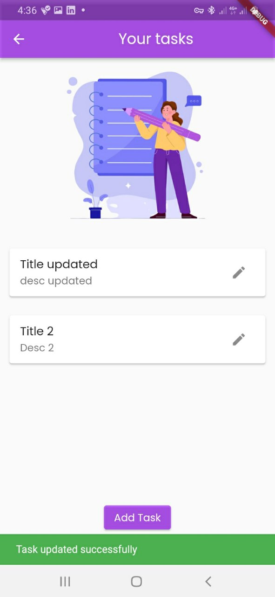
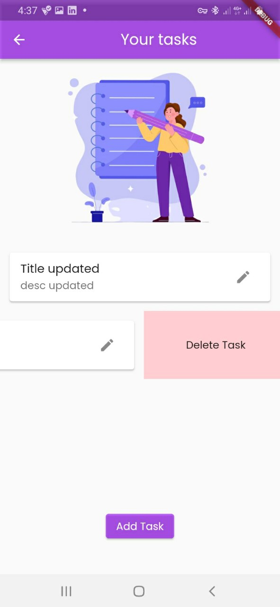
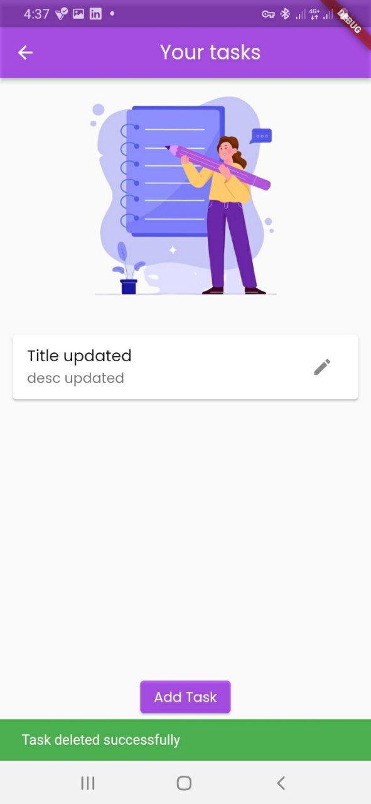

Task Description:
A Todo app built using the `Flutter TDD Clean Architecture` and `Test Driven Development`.
- It connects UI components with the Bloc pattern for state management.
- It applies Clean Architecture principles to maintain separation of concerns and modularity.
- It implements the required UI components and interaction to showcase the task management functionalities.

It integrates and consume the Bloc pattern for various task management functionalities. This will involve:
- creating task
- updating task
- retrieving all tasks
- getting task details

Page Designs and Logic Flow:

- Create Task Page:
    - A designed screen that allows users to input task details and create a new task.
    - Consumes the appropriate bloc method to handle the task creation process.
    - Displays feedback to the user based on the success or failure of the creation process.
- Retrieve All Tasks Page:
    - Designed screen that displays a list of all tasks.
    - Consumes the bloc method responsible for retrieving all tasks.
    - Implements UI components to display the list of tasks, including task titles and statuses.
- Task Detail Page:
    - Designed screen that shows detailed information about a selected task.
    - Consumes the bloc method to fetch task details based on the selected task.
    - Displays the task title, description, due date, and status on the detail page.
- Navigation and Routing:
    - A proper set-up navigation between the task-related pages (create task, all tasks, task detail).
    - Appropriated routing mechanisms to ensure a smooth user experience.
- Testing:
    - Written unit tests to ensure that UI components are correctly connected to the Bloc and reflect the expected behavior.
    - Tests to verify that the UI responds appropriately to different states emitted by the Bloc.
- Code Cleanup and Refactoring:
    - Clean Architecture principles to organize your code into presentation, domain, and data layers.
    - A code which is readable, maintainable, and follows best practices.

  

